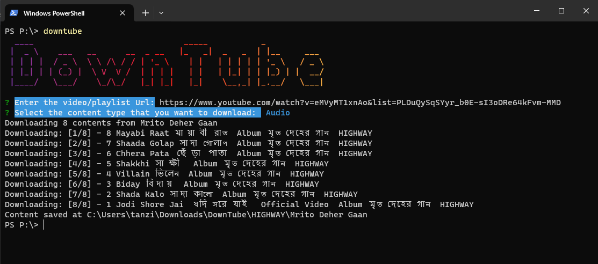
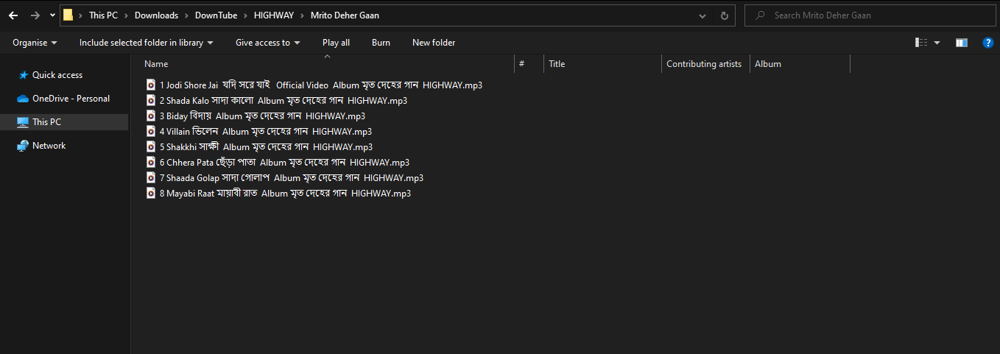

# DownTube

DownTube is a cli tool that download your favorite youtube song/playlist directly to mp3/mp4 format in your computer download folder. It can directly download your content using a video/playlist/channel link.

[**Note:** There is a usages limit to youtube api. So don't over use the program. wait some days to reset the usages limit]

## Installation

1. Download and install [nodejs](https://nodejs.org/en)
1. `npm install -g downtube`

## Usages

1. Open your terminal
1. type `downtube` and press enter
1. Paste the video/playlist link
1. Select the content type [video/audio]
1. Navigate to the shown path to find all your favorite music

## Screenshots

## Project Idea

I used to travel a lot and sometimes the net goes off so I always had to manually download my favorite youtube songs and content from third-party websites. So I thought of making a cli tool to help me with the issue. Here is the project. But it is in beta version so you might find a lots of bug. Please let me know I'll fix them.

Happy DowTube!
